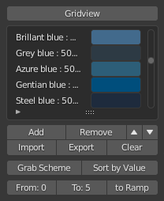
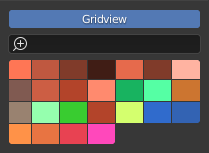

Persistent Library and Scene Library
====================================

The Color libraries permit adding, editing, naming, filtering, reordering and removing of color swatches of a color palette. they have two modes, Listview-mode which is meant for editing of palettes and has all the needed buttons visible and Gridview-mode which is meant for quick access.

Persistent Library
##################

| The Persistent Library keeps the imported or created color swatches and palettes saved in the addons preferences. This means the colors in this library will stay while switching scenes or .blend-files.

.. note::
    Because the colors in the *Persistent Library* are stored in the addon's preferences they will be gone if you disable the addon or update it, as those actions reset the addon's preferences.
 
Scene Library
#############

The Scene Library keeps the imported or created color swatches and palettes saved in the blender file itself. Its the perfect library to store your scene or blendfile specific color presets or schemes.

Listview
########

Gridview:
    Toggle button which switches the library between the two modes.

Name:
    Double click the name of the swatch in the list to change it.

Swatch:
    Single click opens the color picker which lets you choose a color of your liking.

Filter (Hidden until you click the little triangle arrow): 
    Gives access to blenders list filtering options. Let's the user filter by name, sort the list alphabetically or in reverse order. Clicking the magnifying glass inverts the filtering and instead shows everything except the colors which match the querystring.

Add: 
    Adds a new color swatch to the palette, by default its added at the bottom of the list. Name is set to "Color#" and the swatchcolor is set to white.

Remove: 
    Removes the currently highlighted swatch from the color palette

Reorder (up / down arrows): 
    Moves the currently highlighted swatch up or down in the list.

Import: 
    Opens a file dialog and lets the user choose a color palette file to import (.aco, .ase, .acb, .gpl, .kpl, .csv). The imported palette gets added to the end of the current palette.

Export: 
    Opens a file dialog and lets the user choose a location and filename to export the current color palette to.

Clear:
    Clears the color palette and removes all color swatches.

Grab Scheme: 
    Grabs all Color Harmony Groups from the Colorscheme and adds them as named swatches to the current color palette.

Sort by Value: 
    Sorts the color library by value eg. from darkest to brightest color.

From:/ To:/ to Ramp: 
    Enables the user to define a range of colors by selecting a color in the listview and then clicking on From: or To: to define the start and endpoint of the range. The numbers on the From- and To-buttons are the list indices of the colors and will update to the index of the currently selected color when clicked. The to Ramp-button will create a color ramp in the currently open material with the colors set to those in the selected From-To-Range. Negative From-To-ranges are allowed effectively reversing the color order in the ColorRamp-Node. There is a maximum range limit of 32 colors (colorramp node limitation).

Gridview
########

Search Bar / Filter:    
    Allows filtering the Gridview by a querystring. The Gridview updates after the user hits the return/enter key.
