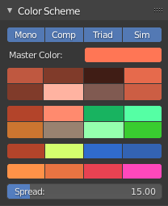

Colorscheme Generator
=====================

Calculates harmonic colors in realtime according to the given master color.

Master Color:
    Color that drives the color harmony calculation algorithm

Mono: 
    Toggles the 8 swatches belonging to the *Monochrome Color Harmony Group*. The group consists of 8 monochrome color shades.

Comp: 
    Toggles the 8 color swatches in the *Complementary Color Harmony Group*. The group consists of 4 shades close to the mastercolor and 4 shades close to the complementary color

Triad: 
    Toggles the 4 color swatches in the *Triadic Color Harmony Group*. The group consists of 1 shade close to the master color (first member), 1 Shade for the second member of the triadic group and 2 Shades for the third member of the triad.

Sim: 
    Toggles the 4 color swatches in the *Similar Colors Harmony Group* and the Spread slider control. The group consists of 4 shades which are spread apart on the color circle by the angle defined with Spread

Spread: 
    Angle that is used to determine the distance between shades in the *Similar Colors Harmony Group*.
