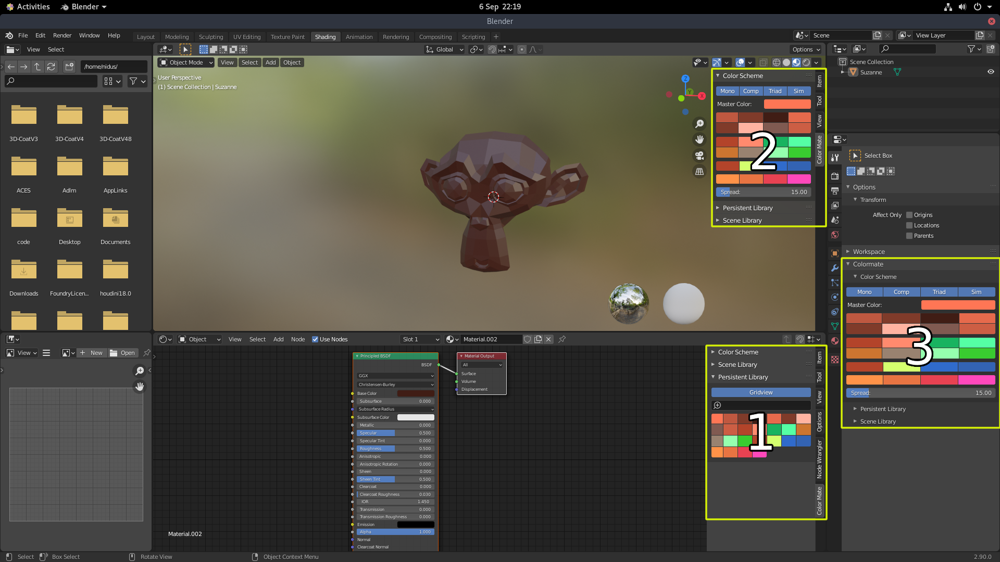

Global Addon Preferences
========================

.. image:: _static/images/bl_pref_colormate_settings.png

Contains the global settings for the colormate addon.

Colorscheme Color Harmony calculation
#####################################

Standard Hue:
    Strictly mathematical calculation of the four Color Harmony Groups. (Example: complementary color is exactly on the opposite of the color wheel 180 deg)

Mapped Hue (Adobe-Kuler-ish): 
    Perceptive calculation of the four Color Harmony Groups. Depending on the hue of the color the calculated color harmonies are shifted towards more pleasing colors. This is close to what Adobe online color harmony tool does to get nicer color harmonies.

Library settings
################

Number of columns in gridview: 
    Changes the amount of columns when the library is in Gridview mode. Adjust this to your liking. This setting affects both library rollouts.

.. _docking_locations:

Panel docking settings
######################

Panels in Node Editor:
    **[1]** Docks the colormate panels in the sidebar of the shader node editor (Hotkey: N)

Panels in Node Editor:
    **[2]** Docks the colormate panels in the sidebar of the 3D view (Hotkey: N)

Panels in ActiveTool:
    **[3]** Docks the colormate panels in the Active Tool section of the properties panel
