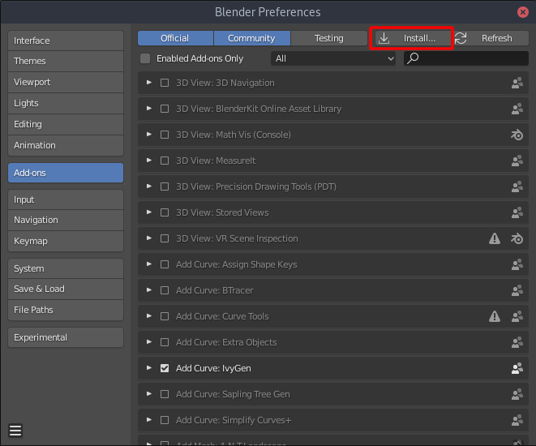
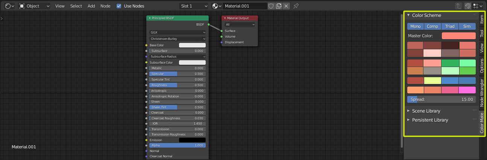
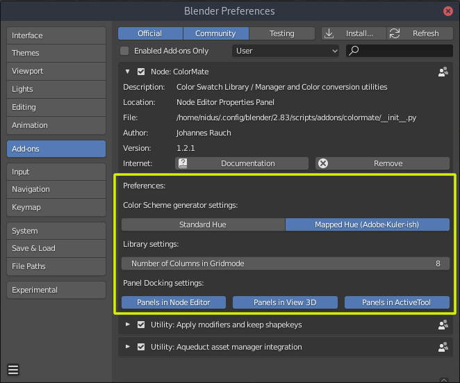

.. ColorMate documentation master file, created by
   sphinx-quickstart on Sat Sep  5 21:27:13 2020.
   You can adapt this file completely to your liking, but it should at least
   contain the root `toctree` directive.

Welcome to ColorMate's documentation!
=====================================

.. toctree::
   :maxdepth: 2
   :hidden:
   :caption: Contents:

Getting Started
===============

Installation
############

After downloading the latest version of ColorMate from blendermarket.com:

#. Open **Blender**
#. Open the **Blender Preferences** via **Edit > Preferences** or **F4 > Preferences**
#. Click on **Add-ons** on the left and choose **Install...** (as shown in the image below)
#. Navigate through your filesystem and select **colormate_x.x.zip**

Where to find it
################

After installation the ColorMate addon can be found in the Shader Node Editor's side panel (Hotkey: N).

If you want to use the ColorMate GUI in a different location in blender don't worry, you can dock the GUI in 3 locations. The locations can be configure in ColorMates Global Addon Preferences.

Global Addon Preferences
========================

.. Indices and tables
.. ==================

.. * :ref:`genindex`
.. * :ref:`modindex`
.. * :ref:`search`
